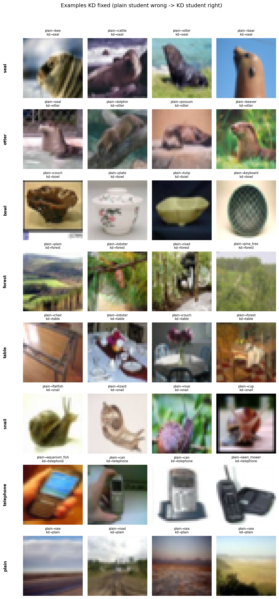
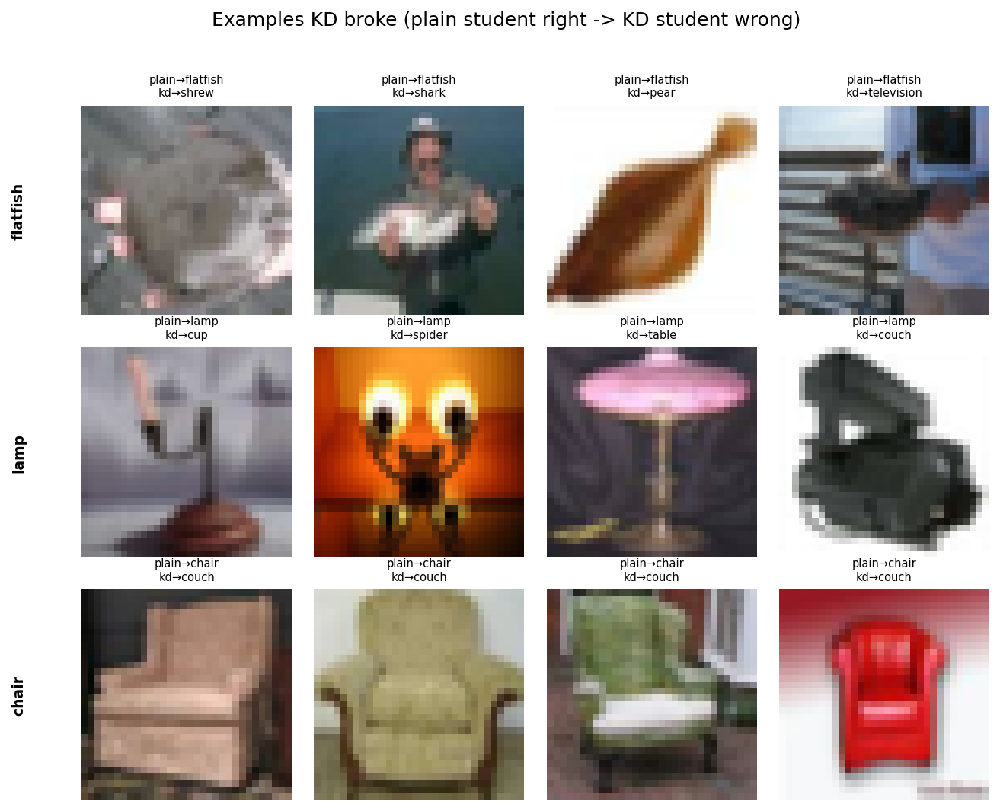

# Knowledge Distillation: A Per-Class Diagnostic Study on CIFAR-100

**Course project — Deep Learning (M.Sc. Data Science)**

## What we're trying to find out

"Knowledge distillation" (KD) is a technique where a small model (the
"student") learns from a big, already-trained model (the "teacher"), instead
of just learning from the raw labels. Most papers just report one number:
"KD improved accuracy by X%." We wanted to check whether that's the whole
story — does KD help *every* class in the dataset equally, or does it help
some classes while quietly making others worse?

To find out, we trained a teacher model, a "plain" student (no KD, just a
normal control), and a KD student, all under identical conditions. Then we
dug into the results class-by-class instead of just looking at the overall
average.

## What we actually found

- KD does make the student more accurate overall (about +1.2 percentage
  points, and we're confident this is a real effect, not noise).
- But KD also makes the student **worse at knowing when it might be wrong**
  (technically: worse "calibration" — its confidence scores are less
  trustworthy). This is a real, measurable trade-off.
- We could **not** confirm that KD hurts or helps specific individual
  classes. Some classes looked better or worse at first, but once we
  properly accounted for the fact that we tested 100 classes at once, none
  of those differences held up statistically. They're most likely just
  noise from having a small number of test images per class (~100 each).

So our headline takeaway changed from "KD is unfair to certain classes"
(not supported by the data) to "**KD trades a bit of accuracy gain for a
real loss in calibration**" — a more honest and more interesting finding.

See [`results/summary.json`](results/summary.json) and
[`results/significance_analysis.json`](results/significance_analysis.json)
for the full numbers.

## How the experiment was set up

| | |
|---|---|
| Dataset | CIFAR-100 (standard version; a version with imbalanced classes is also supported but not required) |
| Teacher model | ResNet-34, pretrained on ImageNet, then trained on CIFAR-100 |
| Student model | ResNet-18, same pretraining |
| Training | 60 epochs, same optimizer and learning rate schedule for all three models, so the only real difference is the loss function |
| KD settings | Temperature = 4.0, alpha = 0.5 (equal weight on the normal loss and the "learn from teacher" loss) |

We trained three models, changing only the loss function each time:

- **`teacher`** — trained normally (no distillation). Its predictions are
  what the KD student learns from.
- **`student_plain`** — trained normally. This is our control/baseline.
- **`student_kd`** — trained using the standard KD method from Hinton et
  al. (2015): it learns partly from the real labels and partly from the
  teacher's "soft" predictions (see [`src/losses.py`](src/losses.py)).

## Results

| Model | Test accuracy | Calibration error (lower = better) |
|---|---|---|
| Teacher (ResNet-34) | 75.37% | 0.105 |
| Student, plain (ResNet-18) | 76.99% | 0.080 |
| Student, KD (ResNet-18) | 78.21% | 0.103 |

(Note: the teacher scoring lower than both students is expected — this is a
known effect in the KD literature called the "capacity gap," not a mistake
in our setup.)

The full breakdown — per-class results, which predictions "flipped" between
models, how confused certain classes are with each other, and calibration
plots — is generated by [`src/analyze.py`](src/analyze.py) and saved in
[`results/`](results/).

The statistics behind our claims (per-class significance testing with a
correction for testing 100 classes at once, and confidence intervals on the
headline numbers) come from
[`src/significance_analysis.py`](src/significance_analysis.py), saved to
[`results/significance_analysis.json`](results/significance_analysis.json).

## What it actually looks like

Actual test images the plain student got wrong that the KD student got
right, for the handful of classes where KD's positive effect held up
statistically (seal, otter, bowl, forest, table, snail, telephone, plain):



And the reverse — images the plain student got right that KD broke, for the
classes where KD's negative effect held up (flatfish, lamp, chair). Notice
how consistent some of these mistakes are — KD doesn't just get chair wrong
randomly, it almost always mistakes it for couch specifically, which is a
nice concrete example of two visually/functionally similar classes getting
confused with each other:



Both images generated by
[`src/make_example_grid.py`](src/make_example_grid.py).

## Repo structure

```
.
├── ckpts/                      saved model checkpoints (teacher, student_plain, student_kd)
├── cluster/                    Kubernetes config for running training on the university's GPU cluster
├── data/                       CIFAR-100 dataset (not included in the repo — see below)
├── logs/                       raw training logs
├── results/                    all output from analyze.py and significance_analysis.py
├── src/
│   ├── data.py                   loads the CIFAR-100 dataset
│   ├── models.py                 builds the teacher/student models
│   ├── losses.py                 the KD loss function and variants
│   ├── train.py                   trains any of the three models
│   ├── analyze.py                 computes per-class results and calibration
│   ├── significance_analysis.py   runs the statistical tests
│   └── make_example_grid.py       builds the example-image figures above
└── Dockerfile
```

## How to reproduce this

The dataset itself isn't included in the repo (it's too large for GitHub).
Download the official CIFAR-100 file and check that it matches this
checksum before using it: `eb9058c3a382ffc7106e4002c42a8d85`.

```bash
# 1. Train the teacher model
python3 src/train.py --mode teacher --arch resnet34 --epochs 60 \
    --save ckpts/teacher.pt

# 2. Train the plain (control) student
python3 src/train.py --mode student_plain --student resnet18 --epochs 60 \
    --save ckpts/student_plain.pt

# 3. Train the KD student
python3 src/train.py --mode student_kd --student resnet18 --epochs 60 \
    --teacher_ckpt ckpts/teacher.pt --teacher_arch resnet34 \
    --T 4.0 --alpha 0.5 --save ckpts/student_kd.pt

# 4. Analyze the results
python3 src/analyze.py \
    --teacher_ckpt ckpts/teacher.pt --teacher_arch resnet34 \
    --student_plain_ckpt ckpts/student_plain.pt \
    --student_kd_ckpt ckpts/student_kd.pt \
    --student resnet18 --out_dir results/

# 5. Run the statistical tests (fast — no GPU or retraining needed)
python3 src/significance_analysis.py --results_dir results/

# 6. (Optional) build the example-image figures
python3 src/make_example_grid.py --results_dir results/ --data_root data/ \
    --n_per_class 4 --include_regressed
```

Each training run takes well under an hour on a single V100 GPU.

## Main takeaways

- **KD really does improve accuracy** — confirmed with a 95% confidence
  interval that doesn't include zero (+0.57 to +1.84 percentage points).
- **KD really does hurt calibration** — the KD student's confidence scores
  are measurably less reliable than the plain student's. This is a
  trade-off that a single accuracy number would completely hide.
- **We can't confirm KD unfairly targets specific classes** — some classes
  looked affected at first glance, but this didn't hold up once we
  corrected for testing 100 classes at the same time.
- **No link found** between how much a class's accuracy changed and how
  visually/semantically confusable that class is with others.
- Checking specific groups of similar-looking classes (like
  chair/table, or boy/girl/man/woman) didn't show any dramatic change
  caused by KD.

Full discussion, limitations, and related work (capacity-gap effects,
calibration under distillation) are in the project report/slides.

## Authors

Benecia ([@Benecia30](https://github.com/Benecia30)) and Greeshma
([@greeshmav11](https://github.com/greeshmav11))
