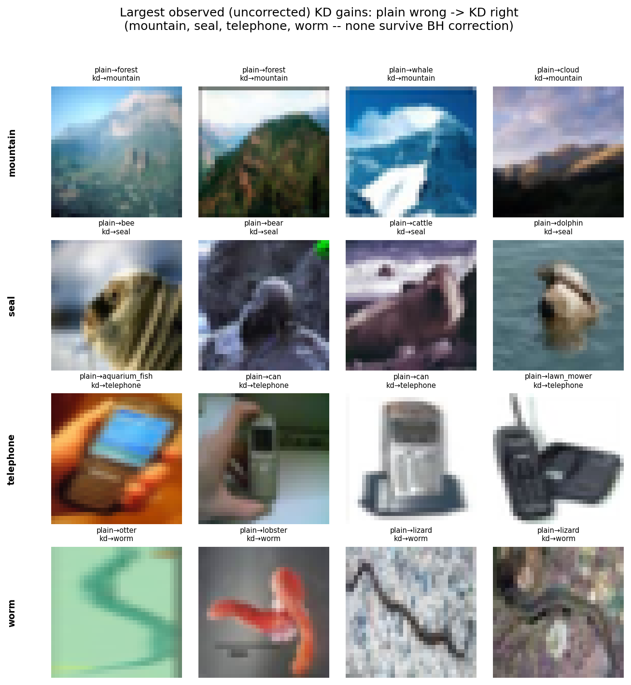
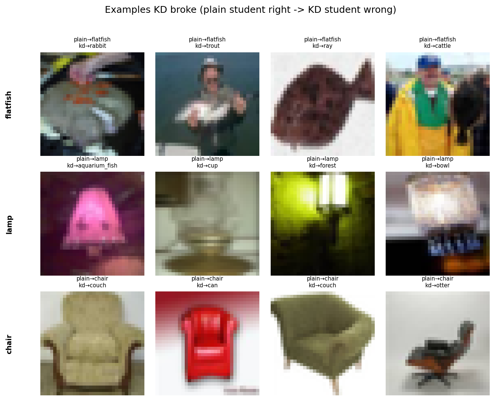

# Knowledge Distillation: A Per-Class Diagnostic Study on CIFAR-100

**Course project — Deep Learning (M.Sc. Data Science)**

## What we're trying to find out

"Knowledge distillation" (KD) is a technique where a small model (the
"student") learns from a big, already-trained model (the "teacher"), instead
of just learning from the raw labels. Most papers just report one number:
"KD improved accuracy by X%." We wanted to check whether that's the whole
story — does KD help *every* class in the dataset equally, or does it help
some classes while quietly making others worse?

To find out, we trained a teacher model, a "plain" student (no KD, just a
normal control), and a KD student, all under identical conditions. Then we
dug into the results class-by-class instead of just looking at the overall
average.

## What we actually found

- KD does make the student more accurate overall (about **+1.8 percentage
  points**, and we're confident this is a real effect, not noise — the 95%
  confidence interval is +1.1 to +2.4 points, well clear of zero).
- But KD also makes the student **worse at knowing when it might be wrong**
  (technically: worse "calibration" — its confidence scores are less
  trustworthy). This is a real, measurable trade-off (+1.9 points of ECE,
  95% CI +1.2 to +2.5 points — also clear of zero).
- We could **not** confirm that KD hurts or helps specific individual
  classes. 5 of 100 classes looked significant before correcting for the
  fact that we ran 100 tests at once — but **zero classes survive
  Benjamini-Hochberg correction** for multiple comparisons. So any
  class-level story is almost certainly noise from having a small number of
  test images per class (~100 each).

So our headline takeaway is: "**KD trades a bit of accuracy gain for a
real loss in calibration**" — this holds up at the aggregate level, while
any claims about *which* classes KD is unfair to do not.

See [`results_50/summary.json`](results_50/summary.json) and
[`results_50/significance_analysis.json`](results_50/significance_analysis.json)
for the full numbers.

## How the experiment was set up

| | |
|---|---|
| Dataset | CIFAR-100 (standard version; a version with imbalanced classes is also supported but not required) |
| Teacher model | ResNet-50, pretrained on ImageNet, then trained on CIFAR-100 |
| Student model | ResNet-18, same pretraining |
| Training | 60 epochs, same optimizer and learning rate schedule for all three models, so the only real difference is the loss function |
| KD settings | Temperature = 4.0, alpha = 0.5 (equal weight on the normal loss and the "learn from teacher" loss) |

We trained three models, changing only the loss function each time:

- **`teacher`** — trained normally (no distillation). Its predictions are
  what the KD student learns from.
- **`student_plain`** — trained normally. This is our control/baseline.
- **`student_kd`** — trained using the standard KD method from Hinton et
  al. (2015): it learns partly from the real labels and partly from the
  teacher's "soft" predictions (see [`src/losses.py`](src/losses.py)).

## Results

| Model | Test accuracy | Calibration error (ECE, lower = better) |
|---|---|---|
| Teacher (ResNet-50) | 80.61% | 0.104 |
| Student, plain (ResNet-18) | 77.01% | 0.080 |
| Student, KD (ResNet-18) | 78.79% | 0.098 |

With this properly-converged ResNet-50 teacher, KD gives a clean net
accuracy gain over the plain student, at the cost of noticeably worse
calibration.

The full breakdown — per-class results, which predictions "flipped" between
models, how confused certain classes are with each other, and calibration
plots — is generated by [`src/analyze.py`](src/analyze.py) and saved in
[`results_50/`](results_50/).

The statistics behind our claims (per-class significance testing with a
correction for testing 100 classes at once, and confidence intervals on the
headline numbers) come from
[`src/significance_analysis.py`](src/significance_analysis.py), saved to
[`results_50/significance_analysis.json`](results_50/significance_analysis.json).

### Per-class picture

- Mean per-class accuracy delta (KD − plain): **+1.78 points** (std 3.9
  points across classes) — 23 classes were hurt, 53 were helped, the rest
  essentially unchanged.
- Of 679 individual test images KD newly got *right* (that plain got
  wrong) and 501 it newly got *wrong* (that plain got right), the net is
  positive, consistent with the accuracy gain above.
- 5 of 100 classes were significant at p<0.05 by McNemar's test before
  correction (**flatfish** hurt; **mountain**, **seal**, **telephone**, and
  **worm** helped) — but **none of these survive Benjamini-Hochberg
  correction**, so we do not treat any individual class as a confirmed
  effect.
- No significant correlation was found between how much a class's accuracy
  changed and how visually/semantically confusable it is with other
  classes (Pearson r=0.11, p=0.28; Spearman ρ=0.12, p=0.25).
- Checking specific suspect groups of similar-looking classes: within-group
  confusion for chair/table went 3.0% (teacher) → 2.4% (plain) → 1.8% (KD),
  and for boy/girl/man/woman went 29.7% (teacher) → 33.9% (plain) → 31.9%
  (KD). In both cases KD's within-group confusion is a bit lower than the
  plain student's, but neither is a large or tested-for-significance
  effect — just descriptive.

## What it actually looks like

Example test images the plain student got wrong that the KD student got
right, for classes with the largest observed (uncorrected) positive
effect — mountain, seal, telephone, worm:



And the reverse — images the plain student got right that KD broke, for
the class with the largest observed (uncorrected) negative effect —
flatfish:



Both images generated by
[`src/make_example_grid.py`](src/make_example_grid.py):

```bash
python src/make_example_grid.py --results_dir results_50/ --data_root ./data --include_regressed
```

## Repo structure

```
.
├── ckpts/                      saved model checkpoints (teacher, student_plain, student_kd)
├── cluster/                    Kubernetes config for running training on the university's GPU cluster
├── data/                       CIFAR-100 dataset (not included in the repo — see below)
├── logs/                       raw training logs
├── results_50/                 all output from analyze.py and significance_analysis.py (ResNet-50 teacher run)
├── src/
│   ├── data.py                     loads the CIFAR-100 dataset
│   ├── models.py                   builds the teacher/student models
│   ├── losses.py                   the KD loss function and variants
│   ├── train.py                    trains any of the three models
│   ├── analyze.py                  computes per-class results and calibration
│   ├── significance_analysis.py    runs the statistical tests
│   ├── make_example_grid.py        builds the example-image figures above
│   └── training_curves_plot.py     plots training curves
└── Dockerfile
```

*(Note: standardized on `results_50/` throughout this README since that's
the folder the current numbers come from — rename to `results/` here and
in the commands below if you'd rather keep the original naming.)*

## How to reproduce this

The dataset itself isn't included in the repo (it's too large for GitHub).
Download the official CIFAR-100 file and check that it matches this
checksum before using it: `eb9058c3a382ffc7106e4002c42a8d85`.

```bash
# 1. Train the teacher model
python3 src/train.py --mode teacher --arch resnet50 --epochs 60 \
    --save ckpts/teacher.pt

# 2. Train the plain (control) student
python3 src/train.py --mode student_plain --student resnet18 --epochs 60 \
    --save ckpts/student_plain.pt

# 3. Train the KD student
python3 src/train.py --mode student_kd --student resnet18 --epochs 60 \
    --teacher_ckpt ckpts/teacher.pt --teacher_arch resnet50 \
    --T 4.0 --alpha 0.5 --save ckpts/student_kd.pt

# 4. Analyze the results
python3 src/analyze.py \
    --teacher_ckpt ckpts/teacher.pt --teacher_arch resnet50 \
    --student_plain_ckpt ckpts/student_plain.pt \
    --student_kd_ckpt ckpts/student_kd.pt \
    --student resnet18 --out_dir results_50/

# 5. Run the statistical tests (fast — no GPU or retraining needed)
python3 src/significance_analysis.py --results_dir results_50/

# 6. (Optional) build the example-image figures
python3 src/make_example_grid.py --results_dir results_50/ --data_root data/ \
    --n_per_class 4 --include_regressed

# 7. (Optional) plot training curves
python3 src/training_curves_plot.py --logs_dir logs/ --out_dir results_50/
```

Each training run takes roughly 24 sec/epoch on a single V100 GPU
(~24 minutes for 60 epochs).

## Main takeaways

- **KD really does improve accuracy** — confirmed with a 95% confidence
  interval that doesn't include zero (+1.1 to +2.4 percentage points).
- **KD really does hurt calibration** — the KD student's confidence scores
  are measurably less reliable than the plain student's (+1.2 to +2.5
  points of ECE, 95% CI). This is a trade-off that a single accuracy number
  would completely hide.
- **We can't confirm KD unfairly targets specific classes** — 5 of 100
  classes looked affected at first glance, but none of them held up once
  we corrected for testing 100 classes at the same time.
- **No link found** between how much a class's accuracy changed and how
  visually/semantically confusable that class is with others.
- Checking specific groups of similar-looking classes (chair/table,
  boy/girl/man/woman) showed a small *decrease* in within-group confusion
  under KD in both cases, but these are descriptive observations, not
  statistically tested effects.

Full discussion, limitations, and related work (capacity-gap effects,
calibration under distillation) are in the project report/slides.

## Authors

Benecia ([@Benecia30](https://github.com/Benecia30)) and Greeshma
([@greeshmav11](https://github.com/greeshmav11))
